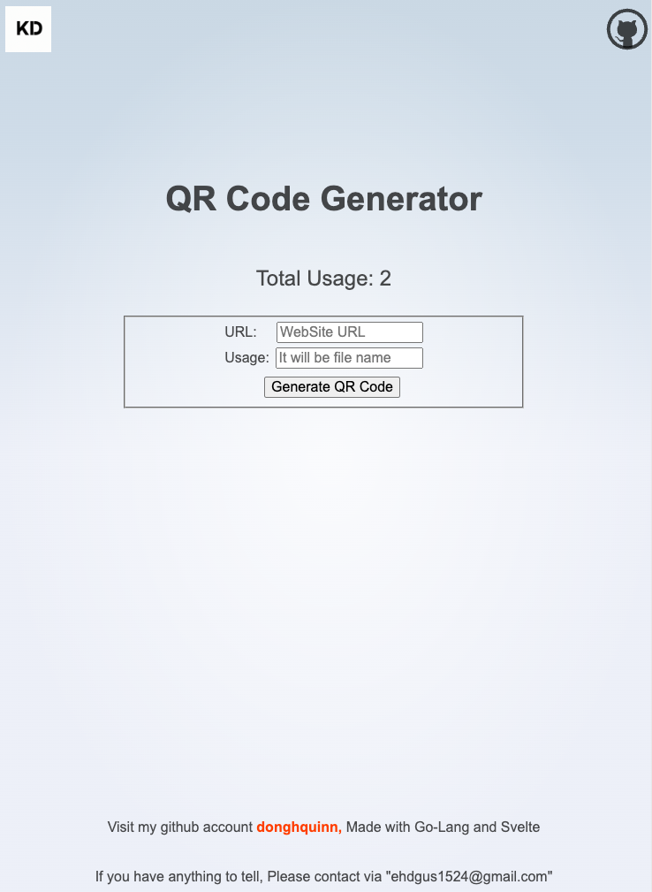

# qrcode_generate

## Languages

- Golang: Backend
- Typescript: Frontend

## Dependencies

- Go-gin: Web Server Framework
- Svelte: Frontend Framework
- PostgreSQL: Database
- Prisma: ORM Client
- Minio: File Server

## Details

- Create QR Code by website's URL link.
- Usage is used as filename.

## TODO

- Click to download
- Design (Layout, Styles, etc)
- Create QR Code of Image File.
- QR Code Styles
